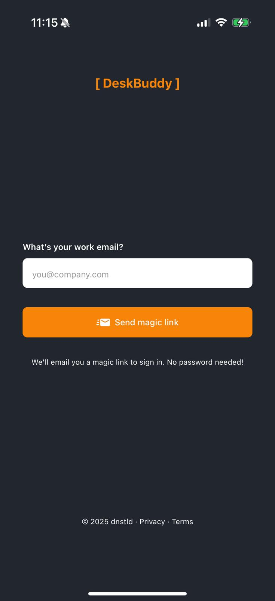
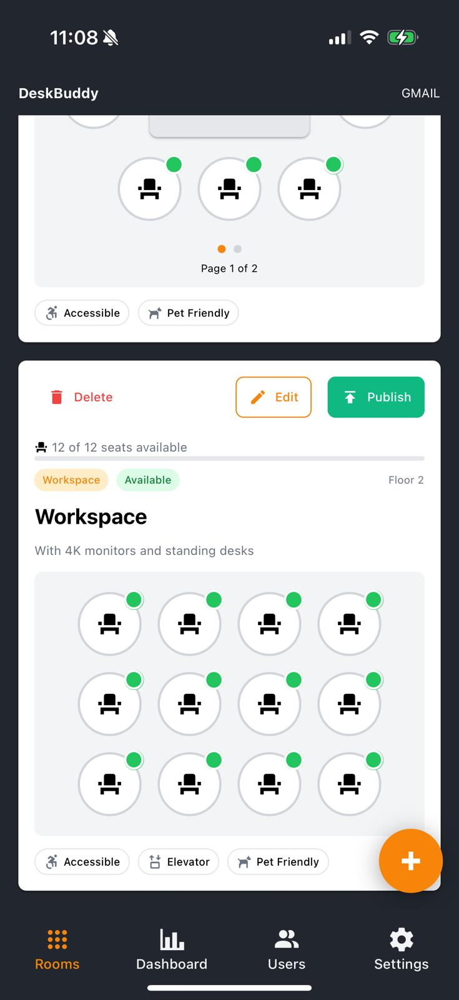
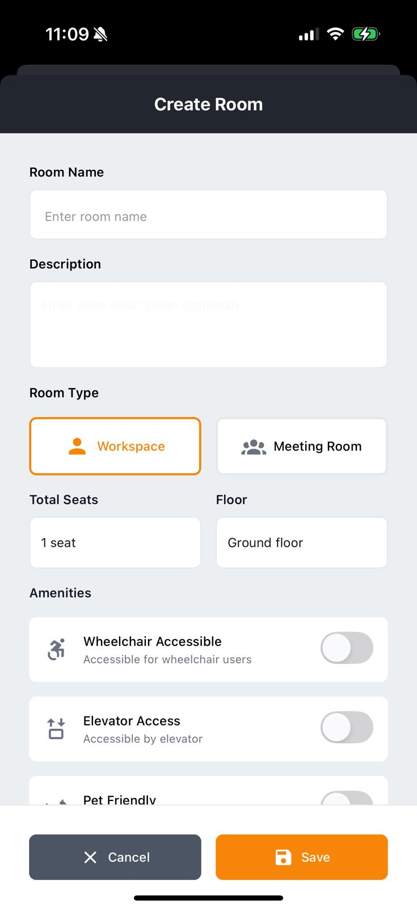
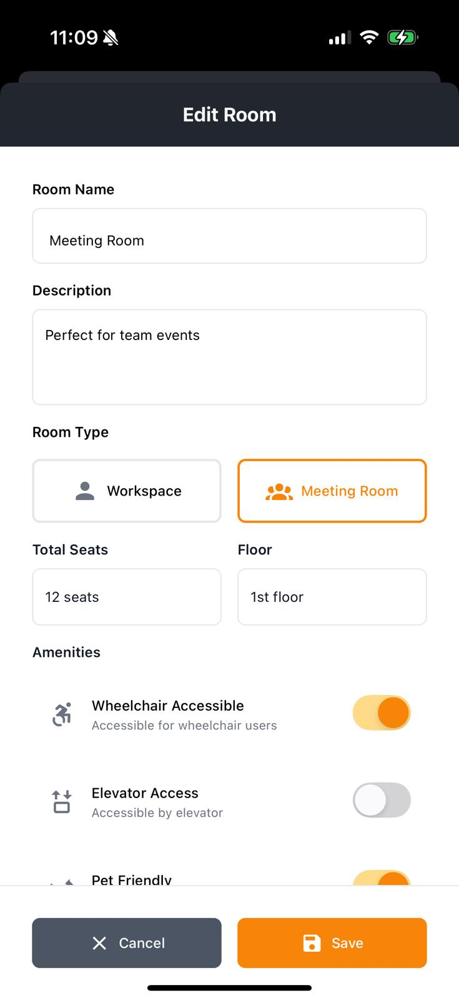
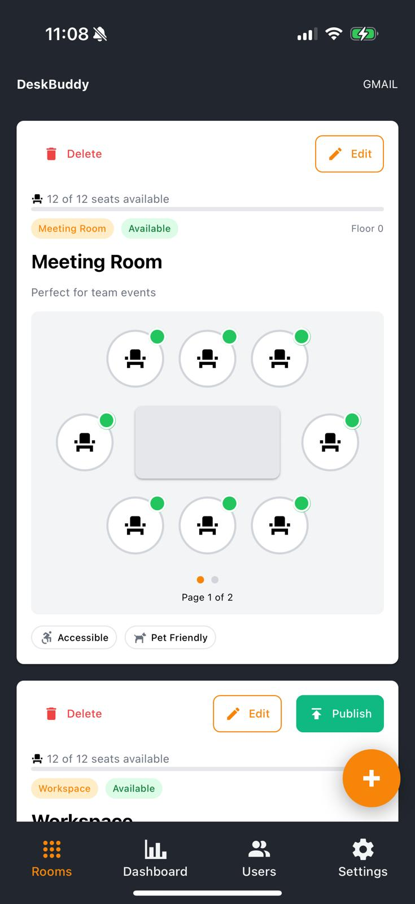
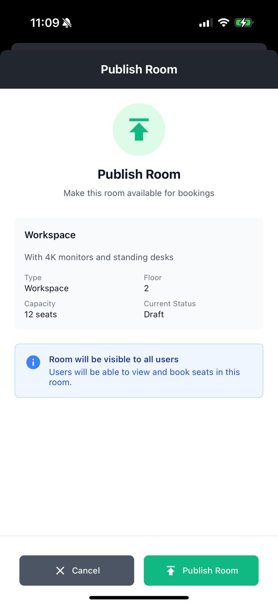
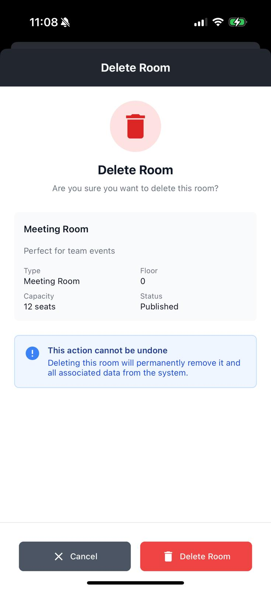
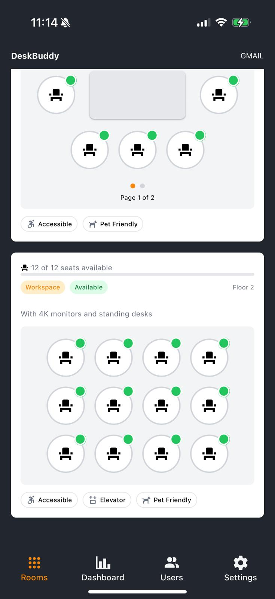
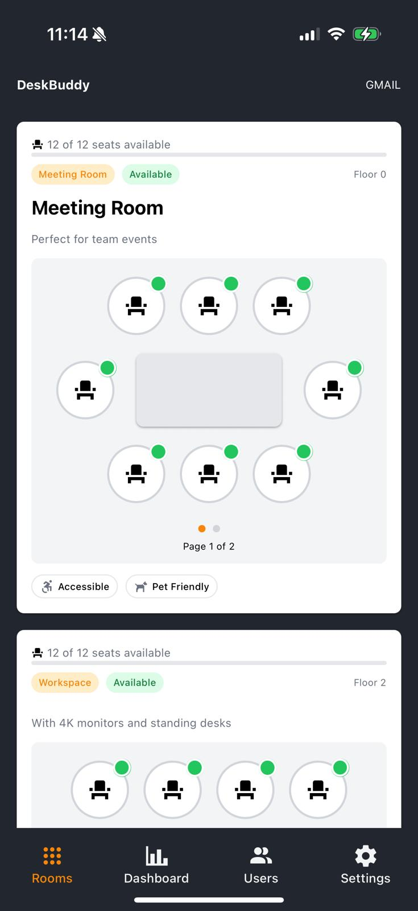

# DeskBuddy - Workspace Booking Application

A modern, enterprise-ready React Native application for managing office desk and meeting room reservations, built with Expo, TypeScript, and Supabase.

---

## 🏗️ Architecture & Development Approach

### **Tech Stack Overview**

- **Framework**: React Native (Expo SDK ~54) with Expo Router for file-based routing
- **Language**: TypeScript with strict type safety
- **Styling**: NativeWind (Tailwind CSS for React Native) for consistent, utility-first styling
- **Backend**: Supabase (PostgreSQL) with real-time subscriptions and Edge Functions
- **State Management**: React Context API with custom hooks for business logic encapsulation
- **Form Management**: React Hook Form + Zod for type-safe validation
- **Package Manager**: pnpm for efficient dependency management

---

## 📂 Project Structure Philosophy

The codebase follows a **feature-driven, scalable architecture** with clear separation of concerns:

```
desk-buddy/
├── app/                          # Expo Router file-based routing
│   ├── (app)/                   # Protected routes (requires authentication)
│   │   ├── dashboard/           # Dashboard feature
│   │   ├── rooms/               # Room management (CRUD operations)
│   │   ├── settings/            # User settings
│   │   └── users/               # User management
│   ├── (auth)/                  # Public authentication routes
│   └── auth/callback.tsx        # Magic link callback handler
│
├── src/
│   ├── components/              # Reusable UI components
│   │   ├── ui/                  # Atomic design system components
│   │   └── [feature]/           # Feature-specific components
│   ├── hooks/                   # Custom React hooks (business logic)
│   ├── lib/                     # Third-party integrations
│   ├── types/                   # TypeScript type definitions
│   ├── validations/             # Zod schemas for runtime validation
│   └── utils/                   # Helper functions
│
├── providers/                   # React Context providers
│   ├── AuthProvider.tsx        # Authentication state management
│   ├── RoleProvider.tsx        # User role/permissions
│   └── ToastProvider.tsx       # Global notifications
│
└── supabase/
    ├── types.ts                # Auto-generated database types
    └── functions/              # Edge Functions (serverless)
```

### **Key Architectural Decisions**

1. **File-Based Routing**: Leveraging Expo Router for intuitive navigation structure
2. **Hook-Based Logic**: Business logic extracted into custom hooks (`use-rooms`, `use-room-mutations`, etc.)
3. **Type Safety**: Database types auto-generated from Supabase schema, ensuring type safety across the stack
4. **Component Composition**: Atomic design principles with reusable UI components
5. **Provider Pattern**: Centralized state management for auth, roles, and notifications

---

## 🗄️ Database Architecture (Supabase/PostgreSQL)

### **Schema Design**

The database follows a **normalized relational model** with the following key entities:

- **`user`**: User profiles and authentication
- **`company`**: Multi-tenant support via email domain parsing
- **`room`**: Workspace/meeting room definitions
- **`seat`**: Individual seats within rooms
- **`reservation`**: Booking records linking users to seats

### **Type Safety Approach**

```typescript
// Auto-generated from database schema
import { Database } from "@/supabase/types";

export type Room = Database["public"]["Tables"]["room"]["Row"] & {
  seats?: Seat[];
};
```

This ensures **compile-time type safety** between frontend and database, catching schema mismatches during development.

### **Real-Time Data Synchronization**

```typescript
// Example from use-rooms hook
const subscription = supabase
  .channel("rooms-changes")
  .on(
    "postgres_changes",
    {
      event: "*",
      schema: "public",
      table: "room",
    },
    () => fetchRooms()
  )
  .subscribe();
```

Real-time subscriptions keep the UI synchronized across devices without polling.

---

## 🔐 Authentication & Security

### **Magic Link Authentication**

- **Passwordless** login via email (OTP)
- Custom deep link handling for mobile apps
- Session persistence with `AsyncStorage`
- Auto-refresh tokens for seamless UX

### **Multi-Tenant Security**

- Row-Level Security (RLS) policies in Supabase
- Company isolation via email domain parsing
- Role-based access control (admin, user)

```typescript
// Edge Function: Automatic company assignment on signup
export const parseEmailDomain = (email: string) => {
  const domain = email.split("@")[1];
  return { domain, companyName: domain.split(".")[0] };
};
```

---

## 🎯 Development Workflow & Best Practices

### **1. Type-First Development**

Every feature starts with TypeScript types and Zod schemas:

```typescript
// Validation schema with business rules
export const roomFormSchema = z
  .object({
    name: z.string().min(1).max(50),
    totalSeats: z.number().int().min(1).max(100),
    meeting: z.boolean(),
    // ... amenities
  })
  .refine(
    (data) => {
      if (data.meeting && data.totalSeats < 2) return false;
      return true;
    },
    {
      message: "Meeting rooms must have at least 2 seats",
      path: ["totalSeats"],
    }
  );
```

### **2. Separation of Concerns**

- **Components**: Pure presentational logic
- **Hooks**: Data fetching, mutations, and business logic
- **Providers**: Global state management
- **Utils**: Pure functions for data transformation

### **3. Error Handling**

Centralized error handling with user-friendly messages:

```typescript
// src/utils/error-handler.ts
export const handleError = (error: unknown) => {
  if (error instanceof Error) return error.message;
  return "An unexpected error occurred";
};
```

### **4. Performance Optimization**

- **Lazy Loading**: Route-based code splitting via Expo Router
- **Optimistic Updates**: Immediate UI feedback before server confirmation
- **Memoization**: `useCallback` and `useMemo` for expensive operations
- **Real-time Subscriptions**: Efficient delta updates instead of polling

---

## 🧪 Code Quality Standards

### **Linting & Formatting**

- ESLint with Expo config for code consistency
- Prettier with Tailwind plugin for style ordering
- TypeScript strict mode enabled

### **Database Management**

```bash
# Migration-based schema changes
pnpm supabase:migration:new add_room_color

# Type generation after schema changes
pnpm supabase:gen:types

# Safe database resets for development
pnpm supabase:db:reset
```

### **Environment Configuration**

- Environment variables for sensitive data
- Runtime validation of required configs
- Separate local/production Supabase instances

---

## 🚀 Getting Started

### **Prerequisites**

- Node.js 18+
- pnpm package manager
- Expo CLI
- Supabase CLI (for local development)

### **Installation**

```bash
# Install dependencies
pnpm install

# Set up environment variables
cp .env.example .env
# Add your Supabase credentials

# Start local Supabase (requires Docker)
pnpm supabase:start

# Start Expo development server
pnpm start
```

### **Development Scripts**

```bash
# Mobile development
pnpm ios                        # Run on iOS simulator
pnpm android                    # Run on Android emulator

# Database operations
pnpm supabase:db:reset         # Reset local database
pnpm supabase:gen:types        # Generate TypeScript types

# Edge Functions
pnpm supabase:functions:serve  # Test functions locally
pnpm supabase:functions:deploy # Deploy to production
```

---

## 📱 App Flows & Screenshots

### **Authentication Flow**

<div align="center">

|                             Login Screen                             |                                Email Sent                                 |                                Expired Link                                 |
| :------------------------------------------------------------------: | :-----------------------------------------------------------------------: | :-------------------------------------------------------------------------: |
|  |  |  |
|                       Users enter their email                        |                       Magic link sent confirmation                        |                      Error handling for expired links                       |

</div>

**Implementation Highlights:**

- Passwordless authentication with email OTP
- Deep link handling for mobile magic links
- User-friendly error states with retry options
- Session timeout detection

---

### **Room Management Flow (Owner)**

<div align="center">

|                                    Workspace View                                    |                              Create Room                              |                              Edit Room                              |
| :----------------------------------------------------------------------------------: | :-------------------------------------------------------------------: | :-----------------------------------------------------------------: |
|  |  |  |
|                            Grid layout of available rooms                            |                         Form with validation                          |                         Update room details                         |

|                                 Meeting Room View                                  |                              Publish Room                              |                              Delete Room                              |
| :--------------------------------------------------------------------------------: | :--------------------------------------------------------------------: | :-------------------------------------------------------------------: |
|  |  |  |
|                            Meeting room with seat grid                             |                          Publish draft rooms                           |                          Confirmation dialog                          |

</div>

**Implementation Highlights:**

- Complete CRUD operations with optimistic updates
- Inline form validation using React Hook Form + Zod
- Visual seat grid with real-time occupancy
- Role-based UI (owners see edit/delete actions)
- Draft/publish workflow for room management

---

### **Room Viewing (Member Role)**

<div align="center">

|                                    Workspace View                                     |                                  Meeting Room View                                  |
| :-----------------------------------------------------------------------------------: | :---------------------------------------------------------------------------------: |
|  |  |
|                              Read-only view for members                               |                           Meeting room seat availability                            |

</div>

**Implementation Highlights:**

- Role-based access control (members cannot edit)
- Real-time seat availability updates
- Clean, intuitive grid visualization
- Responsive layout adapts to room configuration

---

## 🎨 Styling Approach

**NativeWind** provides a consistent design system with Tailwind utility classes:

```tsx
<View className="flex-1 bg-background p-4">
  <Text className="text-lg font-bold text-white">DeskBuddy</Text>
</View>
```

- **Benefits**:
  - Rapid prototyping
  - Consistent spacing/color system
  - Type-safe with autocomplete
  - Easy responsive design

---

## 📊 Features Implemented

### **Core Functionality**

- ✅ Magic link authentication (passwordless)
- ✅ Multi-tenant company support
- ✅ Room management (create, edit, delete, publish)
- ✅ Seat grid visualization
- ✅ Real-time updates across devices
- ✅ Role-based access control
- ✅ Form validation with user feedback
- ✅ Toast notifications system
- ✅ Deep linking support

### **Technical Features**

- ✅ Offline session persistence
- ✅ Auto-generated database types
- ✅ Real-time Supabase subscriptions
- ✅ Custom hook architecture
- ✅ Error boundary handling
- ✅ Type-safe form management

---

## 💡 Development Philosophy

This project demonstrates:

1. **Enterprise-Grade Architecture**: Scalable structure ready for team collaboration
2. **Type Safety**: End-to-end TypeScript with runtime validation
3. **Developer Experience**: Fast feedback loops with hot reload, type checking, and linting
4. **Maintainability**: Clear separation of concerns, reusable components, and comprehensive documentation
5. **Production-Ready**: Environment configuration, error handling, and security best practices
6. **Modern Stack**: Latest React Native patterns with Expo, server-driven UI, and real-time capabilities

---

## 📚 Additional Documentation

- [Supabase Scripts Reference](./SUPABASE_SCRIPTS.md) - Database and Edge Function commands
- [Environment Setup](./docs/environment.md) - Configuration guide
- [Contributing Guidelines](./docs/contributing.md) - Development workflow

---

## 🔗 Resources

- [Expo Documentation](https://docs.expo.dev)
- [Supabase Documentation](https://supabase.com/docs)
- [NativeWind Documentation](https://www.nativewind.dev)
- [React Hook Form](https://react-hook-form.com)
- [Zod Validation](https://zod.dev)
